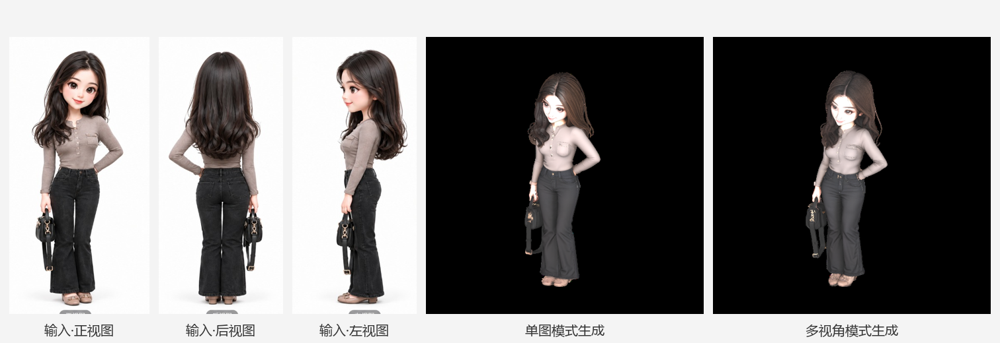

# Hunyuan 3D Multiview · 混元多视角图生 3D 工作流

[](LICENSE)
[](#环境要求)
[](#环境要求)
[](https://cloud.tencent.com/document/product/1770)

**A WorkBuddy agent skill for image-to-3D generation with multi-view inputs (front + back + left/right) — powered by Tencent Hunyuan3D (混元生3D), fully Base64, no image hosting required.**

一个 [WorkBuddy](https://www.workbuddy.cn) 智能体技能：把三视图 / 多视角图片变成可下载的 **3D 手办模型（GLB / OBJ，含 PBR 材质）**，走腾讯混元生 3D（SubmitHunyuanTo3DProJob）官方 API。核心亮点：**多视角图片全程走 `ViewImageBase64` 字段直连，无需公网图床**——这是 WorkBuddy 内置 `buddy-cloud.py` 不支持的能力。



## ✨ 特性 / Features

- 🖼️ **多视角输入**：front 主图 + `back` / `left` / `right`（3.1 版本还支持 `top` / `bottom` / `left_front` / `right_front` 八视图），背面与侧面细节不再靠 AI"猜"
- 🔐 **免图床**：所有视角图以 Base64 内嵌请求体（官方 `ViewImageBase64` 字段），本地图直接用
- 📦 **标准产物**：GLB（50MB 级，含 PBR 贴图）+ OBJ + 渲染预览图，可直接导入 Blender / Fusion 360 / 3D 打印切片
- 🖥️ **内置预览**：自动生成 [model-viewer](https://modelviewer.dev/) 交互预览页（旋转 / 缩放 / 自动旋转）
- 🔁 **健壮轮询**：任务提交后自动轮询（5s 间隔，最长 600s），Token 全程 stdin 传递、输出自动脱敏

## 📊 实测数据（单图 vs 多视角）

| 指标 | 单图模式 | 多视角模式 |
|------|---------|-----------|
| 输入 | 仅正视图 | 正视图（主图）+ 后视图 + 左视图 |
| 耗时 | ~3.5 min | ~6 min |
| 消耗 | 30 点（Normal 20 + PBR 10） | 40 点（Normal 20 + **MultiView 10** + PBR 10） |
| 背面还原度 | 依赖模型推断 | 按输入视图精确还原 |

## 🚀 快速开始 / Quick Start

### 1. 环境要求

- Python 3.10+（含 `requests`，脚本所在 WorkBuddy 环境已内置）
- WorkBuddy Desktop（提供 `connect_cloud_service` 临时凭证与 `buddy-cloud.py` 签名通道）
- 一个三视图 / 多视角图片（正 / 后 / 左各占约 1/3 宽度，白底最佳）

### 2. 安装技能（三选一，前两种一步到位）

**方式 A · 一行命令安装（推荐）**

Windows（PowerShell）：

```powershell
irm https://raw.githubusercontent.com/hwdemtv/hunyuan-3d-multiview/main/install.ps1 | iex
```

macOS / Linux：

```bash
curl -fsSL https://raw.githubusercontent.com/hwdemtv/hunyuan-3d-multiview/main/install.sh | bash
```

**方式 B · 直接把仓库地址丢给 WorkBuddy**

在 WorkBuddy 对话中发送：

> 安装技能：https://github.com/hwdemtv/hunyuan-3d-multiview

WorkBuddy 会读取仓库、审计技能安全后自动装入 `~/.workbuddy/skills/hunyuan-3d-multiview/`。

**方式 C · 手动复制**

把本仓库的 `SKILL.md` 与 `scripts/` 复制到 `~/.workbuddy/skills/hunyuan-3d-multiview/`（Windows 为 `%USERPROFILE%\.workbuddy\skills\hunyuan-3d-multiview\`）。

### 3. 裁剪视角图

从整张三视图里按 1/3 宽度裁出 `front` / `back` / `left`（去掉底部文字标注），用 PIL 存为 jpg（quality 92，单边 ≥128px，多视角 base64 总和 ≤6MB），放到 `.hy3d/inputs/`。

### 4. 生成（任务文件状态机：可续跑、不重复付费）

```bash
# 登记任务
python scripts/multiview_3d_driver.py init \
  --front .hy3d/inputs/front.jpg --back .hy3d/inputs/back.jpg --left .hy3d/inputs/left.jpg

# 离线自检：不花点数，先确认图片与参数没问题
python scripts/multiview_3d_driver.py check .hy3d/jobs.json

# 提交（token 走 stdin）
echo -n "<tempToken>" | python scripts/multiview_3d_driver.py submit .hy3d/jobs.json

# 轮询 + 下载 GLB/预览图 + 生成 model-viewer 预览页
echo -n "<tempToken>" | python scripts/multiview_3d_driver.py collect .hy3d/jobs.json
```

- `<tempToken>`：由 WorkBuddy 的 `connect_cloud_service` 工具返回（**不要**写进命令行参数、环境变量或文件）
- 一条 `run` 可走完 check → submit → collect
- 中间产物全部落在 `.hy3d/`（`jobs.json` 为唯一事实来源，已 gitignore），不污染工作区
- 失败按错误分级恢复：`invalid-*` 改输入重试；`submission-uncertain` **禁止自动重提**（需显式 `--force-retry`）；`download-error` 只重下、不重新生成

## 🧠 为什么多视角 + Base64？

- 混元生 3D 的官方数据结构 `ViewImage` 同时支持 `ViewImageUrl` 与 **`ViewImageBase64`**，但 WorkBuddy 内置脚本只封装了前者。本技能用 `importlib` 加载内置脚本模块，直接复用其 TC3 签名与轮询逻辑、自由构造请求体，从而绕开"必须先上传图床"的限制。
- 多视角输入让背面发型、服装背面、侧面轮廓按图纸还原，是 3D 手办 / 数字资产（如 MakerWorld 作品）生产管线的关键一环。

## ❓ FAQ

**Q: 没有三视图，只有一张普通照片可以吗？**
可以，`--front` 单图即可跑（单图模式），只是背面细节由模型推断。

**Q: 视角图必须是"标准三视图排版"吗？**
不需要，API 收的是一张张独立图片；整图排版只是方便一次截图后裁剪。

**Q: 费用怎么算？**
实测 3.1 版：Normal 20 点 + MultiView 10 点 + PBR 10 点 = 40 点/次；单图 30 点/次。

**Q: 能在花钱之前先发现问题吗？**
能。`check` 是离线的、不需要 token：校验图片格式/尺寸/体积/base64 总量、视角合法性、参数兼容性（如 model 3.1 不支持 LowPoly），并给出输入图质量提示（背景是否纯色、主体占比）。有问题退出码为 1。

**Q: 支持 Linux / macOS 吗？**
脚本本身跨平台（纯 Python）；`SKILL.md` 中的路径示例以 WorkBuddy Desktop Windows 环境为准，其他平台改一下 `buddy-cloud.py` 路径即可（也可用环境变量 `BUDDY_CLOUD_SCRIPT` 覆盖）。

## 📁 目录结构

```
hunyuan-3d-multiview/
├── SKILL.md                       # 路由式入口：选模式 → 指向对应手册
├── references/
│   ├── workflow.md                # 步骤、.hy3d/jobs.json 结构、错误分级与恢复
│   ├── api-params.md              # 参数/视角/费用/校验规则/成本档位
│   └── env-pitfalls.md            # Windows / WorkBuddy 环境坑
├── scripts/
│   └── multiview_3d_driver.py     # init / check / submit / collect / run
├── install.ps1  install.sh        # 一行安装
├── CONTRIBUTING.md                # 提交改动需附真实生成结果
└── assets/                        # 示例输入视图与生成结果预览
```

运行期产物落在 `.hy3d/`（`jobs.json` + `outputs/`），已 gitignore。

## 🏷️ 关键词

`腾讯混元` `Hunyuan3D` `图生3D` `image-to-3d` `multi-view 3D generation` `3D 手办` `figurine` `GLB` `OBJ` `PBR` `model-viewer` `WorkBuddy` `agent skill` `AI 3D` `三视图建模` `3D printing` `MakerWorld`

## 📄 License

[MIT](LICENSE)
